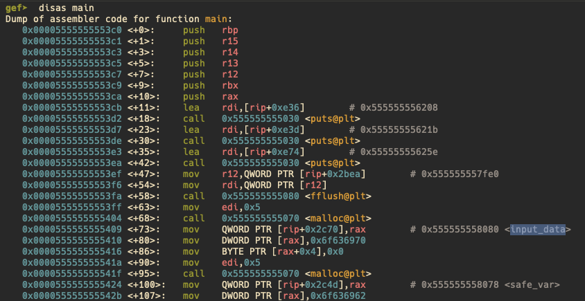
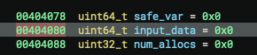
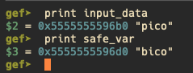
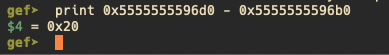
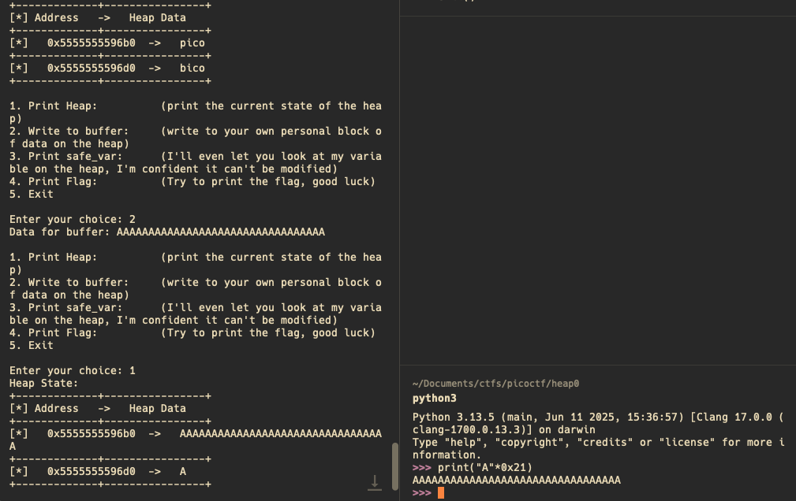
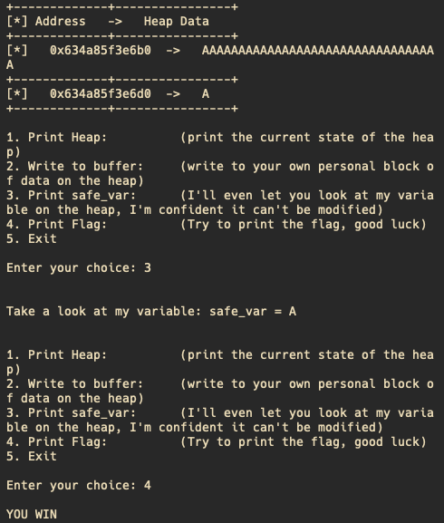
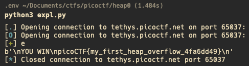
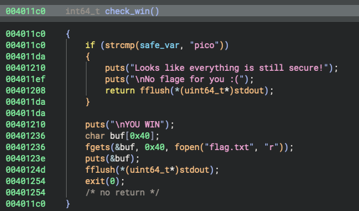
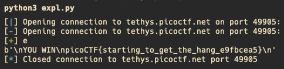

+++
date = '2025-10-26T13:00:02+01:00'
draft = true
title = 'Heap Exploiting Part1'
+++

# Introduction

When talking about binary exploitation, there is a set of vulnerabilities to exploit, which are memory corruption vulnerabilities (like the famous stack overflows). However, there is yet another type of memory corruption vulnerabilities that lay on the heap (that is, dynamic memory). In this region, many vulnerabilities such as Use After Frees, Heep based Overflows, etc take place.

Some time ago, when learning about binary exploitation, I stumbled upon this topic and got so overwhelmed that I did not continue exploiring it any further. However, after having attended some conferences like the OBTS (Objective By The Sea) where incredible researchers showed all their findings, I could not hold it anymore and decided to pick it up where I left it, giving it another try, but this time, trying my best to bring it to the very end, and that is why I am writing this blogpost, to force myself not only to keep learning, but also to understand every bit of information that I get.

In this first episode, I will explain the solutions for some of the PicoGym challenges from the [PicoCTF](https://picoctf.org/) platform. Those challenges are still quite basic and are exploited in the same way as a normal stack based memory corruption vulnerability, but hey, better start small and bring it up step by step.

With no further talk, let's begin.

# Challenge #0: heap0


## Reversing

First things first: Although the challenge provides the `.c` file, I will always use the decompiler to read the code, that way, I will keep the same standard for more challenging challenges, avoiding oversimplification that will cause trouble on future challenges.

The overall overview of the main routine looks like this:


By looking at it there is an interesting function at case `3` called `check_win()`, which does the following:


Great! So now we know that in orther to get the flag, we somehow need to change the value of the variable `safe_var`. 

The following lines of code handle how the data get's saved to the buffer:


As we see, this is not something by any means "fancy" but rather rudimentary, just with a `scanf` with no check on the input length. This input lenght was defined before on the function:


Both the `safe_var` and the `input_data` are defined as `malloc`'s of 5 characters each, so there we have it! After writing 5 values, we will be overflowing some other data on the heap, and at some point, we will be overflowing the `safe_var` variable when we write onto the `input_data`.


## Vulnerability trigger

Once the vulnerability is discovered, it is time to trigger it. For that we could brute force the input until we see that the data is getting where we want it to go, or we can do it smartly with a debugger. Of course in this type of challenges the address is already being printed on the terminal, but for the same reason as with the decompiler, I will start doing things "the hard way" from the very beginning.

With that being said, let's dive in into debugging this with `gdb`with `gdb advanced features`(`gef`):



That is the view from the main function from gdb. We see that we have the names of the variables `input_data` and `safe_var`. With the command `print` on `gdb` we can see what memory addresses do they point to, as they are pointers (due to being strings) Actually, here is a good point to clarify that the address `0x555555558080` is not where `input_data` is stored, but rather where the **pointer** to input data, that is, the place where the real address of the start of the allocated memory. That can be prooven by looking at the `.data` section of the binary:



As we can see, they are defined as uint64, hence they are a `64 bit` number, which corresponds to the pointer length on `amd64` architecture.

With that being said, let's continue analyzing the code on the debugger to see where are those variables actually residing.

Using the print function, we get the following addresses:


With those addresses we can calculate what is the distance between them: 



Cool, so now we know that we need to write more than `0x20` characters (32 in decimal) on  `input_data` to start overflowing the `safe_var` variable. Let's do a quick PoC:




Great!! So we triggered the vulnerability and successfully overwritten the value on `safe_var`. Actually, if we tried to print the flag, it would work already:



However, in order to keep pursuing the goal of making everything "the ~~right~~ hard way" from the begining, let's keep going and write a nice exploit.

## Exploit

Writing an exploit means writing a program that will automte all this steps in order to make exploitation replicable. In this case we will be using `pwntools`, a python library that helps a lot on writing this kind of exploits, specially for ctfs. I won't get much into the details of `pwntools`, but I will leave here my exploit, which simply implements everything we've done.

```python

from pwn import *

process = remote("yourendpoint", <yourport>)

payload = b"A" * 0x21
process.recvuntil(b"Enter your choice: ")
process.sendline(b"2")
process.recvuntil(b"Data for buffer: ")
process.sendline(payload)
process.recvuntil(b"Enter your choice: ")
process.sendline(b"4")
print(process.recv())
```

When executing this we receive a very nice flag!!



# Challenge #1: heap1

Following the challenges PicoCTF offers on heap exploiting, they offer this challnge, which at first sight is fairly similar to the last one, with the only difference that it actually needs the overflowed data to be something specific:



As we see on the image, now the data needs to be `pico` in order to get the flag. Not so difficult right?

Since most of teh concepts are quite the same as in the previous challenge, I will jump directly to the exploit.

## Exploit

For the exploit I will reuse the last one but will add the `pico` thing instead of just writing one more "A" into `safe_var`.


```python

from pwn import *

process = remote("yourendpoint", <yourport>)

payload = b"A" * 0x20
payload += b"pico"
process.recvuntil(b"Enter your choice: ")
process.sendline(b"2")
process.recvuntil(b"Data for buffer: ")
process.sendline(payload)
process.recvuntil(b"Enter your choice: ")
process.sendline(b"4")
print(process.recv())
```


And with that, the callenge is solved.

