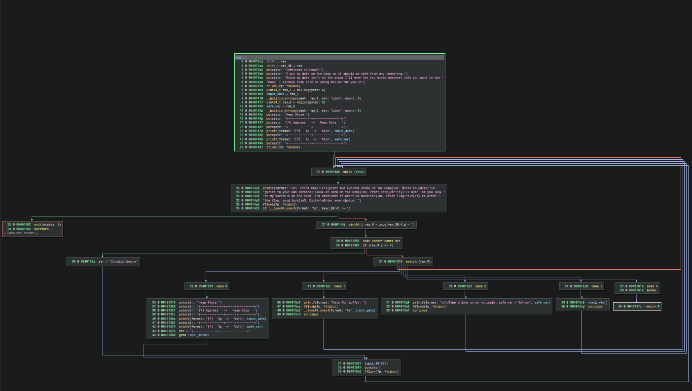
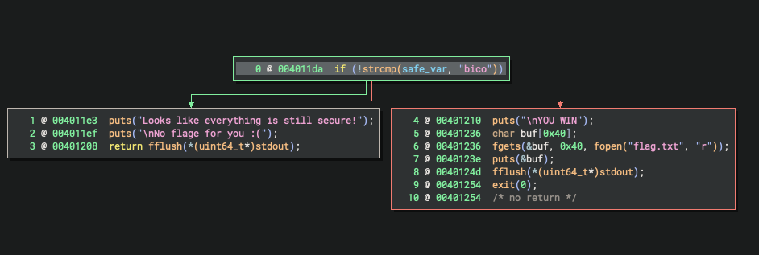
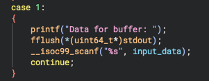
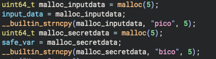

+++
date = '2025-10-26T13:00:02+01:00'
draft = true
title = 'Heap Exploiting Part1'
+++

# Introduction

When talking about binary exploitation, there is a set of vulnerabilities to exploit, which are memory corruption vulnerabilities (like the famous stack overflows). However, there is yet another type of memory corruption vulnerabilities that lay on the heap (that is, dynamic memory). In this region, many vulnerabilities such as Use After Frees, Heep based Overflows, etc take place.

Some time ago, when learning about binary exploitation, I stumbled upon this topic and got so overwhelmed that I did not continue exploiring it any further. However, after having attended some conferences like the OBTS (Objective By The Sea) where incredible researchers showed all their findings, I could not hold it anymore and decided to pick it up where I left it, giving it another try, but this time, trying my best to bring it to the very end, and that is why I am writing this blogpost, to force myself not only to keep learning, but also to understand every bit of information that I get.

In this first episode, I will explain the solutions for some of the PicoGym challenges from the [PicoCTF](https://picoctf.org/) platform. Those challenges are still quite basic and are exploited in the same way as a normal stack based memory corruption vulnerability, but hey, better start small and bring it up step by step.

With no further talk, let's begin.

# Challenge #1: heap0

First things first: Although the challenge provides the `.c` file, I will always use the decompiler to read the code, that way, I will keep the same standard for more challenging challenges, avoiding oversimplification that will cause trouble on future challenges.

The overall overview of the main routine looks like this:

By looking at it there is an interesting function at case `3` called `check_win()`, which does the following:

Great! So now we know that in orther to get the flag, we somehow need to change the value of the variable `safe_var`. 

The following lines of code handle how the data get's saved to the buffer:

As we see, this is not something by any means "fancy" but rather rudimentary, just with a `scanf` with no check on the input length. This input lenght was defined before on the function:

