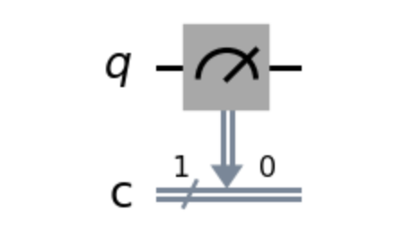
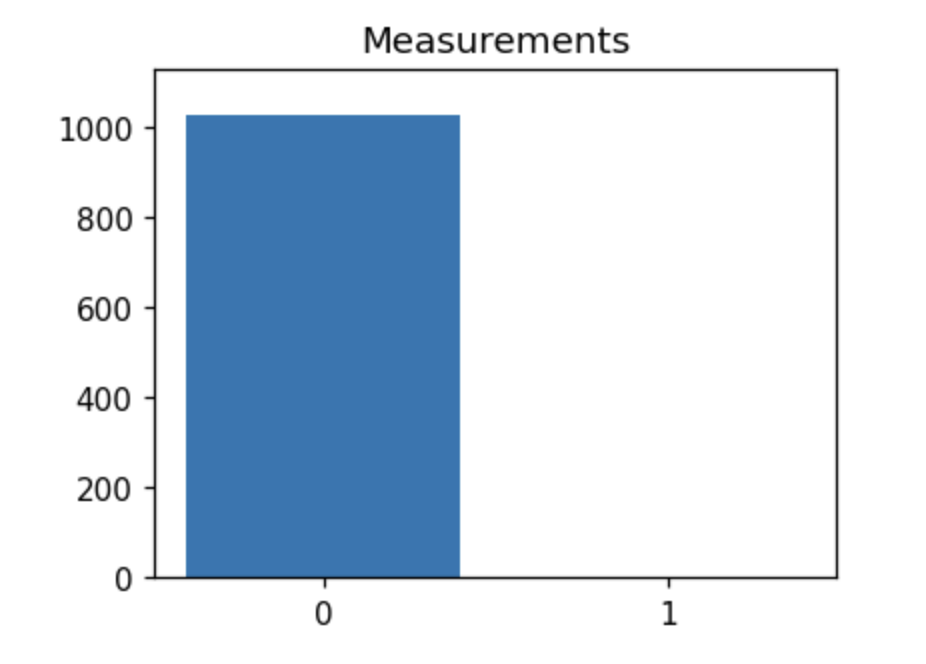
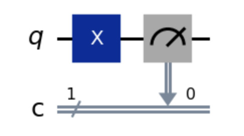
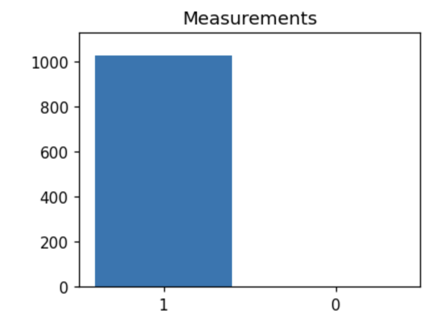

+++
date = '2025-08-01T18:42:17+02:00'
draft = true
title = 'Quantum Computing Basics'
tags = ['quantum']
+++

# Introduction

Many years ago, I got really fascinated by quantum computing and everything it offered, but unfortunatelly, I lacked many of the computer science and mathematical concepts that would lead me to understand it. Now, although I still lack some of those concepts, I felt like I would have a higher chance of succeeding, so I decided to give it a shot and get a nodge of this amazing field.

## Disclaimer

In this series of blog posts, I will be showing the things that I learn about quantum computing. It is not meant to be something where you can learn from, but reather something you can take as inspiration about how am I doing it. I am not by any means a quantum computing expert, neither a physics or math PhD, so keep that in mind when reading this articles.

# What is Quantum Computing?

Quantum Computing refears to the computations made by a Quantum Computer, which instead of using `bits`, it uses `qbits`. Over the course of this article, I will refear to Quantum Computers as, well, Quantum Computers, and to "normal" computers as Classical Computers, just to follow the field notation.

## Qbits vs Bits

As you might already know, `bits` are the building blocks of Classical Computers, and we use them everywhere (transmission speeds, storage, etc). A `bit` is essentially the smallest unit of information in Classical Systems, and it has two states:

- 0 -> Denotes that it is not activated, or that something is false.
- 1 -> Denotes that something is activated or that something is true.

`bits` do not have any other state, that is, they are either 0 or 1, not 2, not 1.5, not 0 and 1, but 0 or 1.

Precisely this is something where `bits` and `qbits` diffear, and probably the most famous property due to the famous "Schrodinger's Cat Experiment".

Unlike `bits`, `qbits` can be in a superposition, that is, they can be both in the state 1 and 0. It's only when we observe them (or meassure them) that we see what value they hold (either 0 or 1). Once meassured, the quantum state collapses and we can treat it as a `bit`. 

The following image shows a circuit with a `qbit` in the $\Bra{0}$ state. Note that I introduced now the Dirac Notation ($\Bra{X}$). This is a way of representing the states of a `qbit`, very hand and very used when defining quantum states.

We see that we just measure the state of the qbit after doing nothing. We can see that, as expected, it is 0. Analogously, we see that if we include a `NOT` gate, which in quantum systems is named `X` gate, we get the following:

Great! So we know now that, in deed, we can measure the states of qbits
