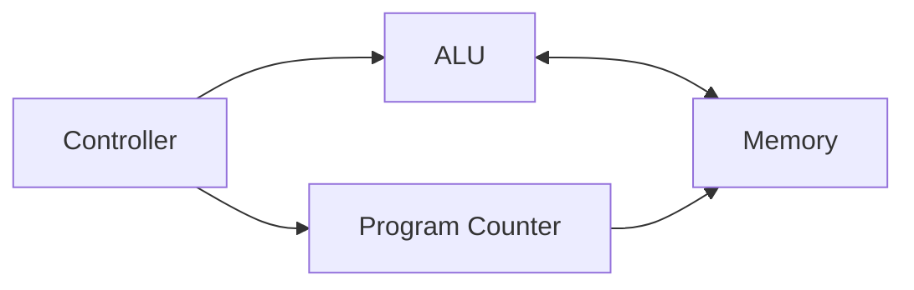
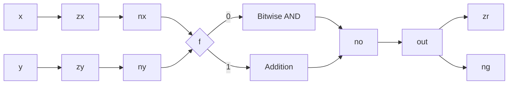
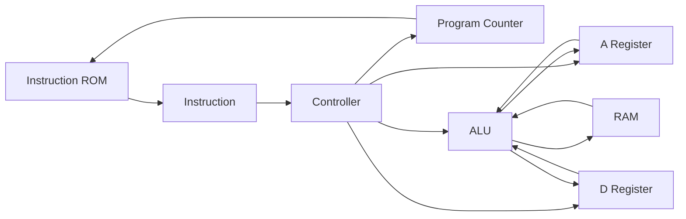
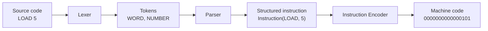

> Disclaimer: The entire design of the CPU is based on the one proposed by the Nand2Tetris Project. However, the implementation is 100% mine; therefore, differences between the original and this version are to be expected.

# Introduction

Have you ever thought about how the hell a computer actually works? I know, it sounds like one of those questions that everyone has asked themselves at least once. I certainly did. At university, I took several courses that were supposed to explain exactly that. We learned about logic gates, synchronous and asynchronous circuits, flip-flops, registers, ALUs... basically, all the building blocks that make up a CPU. The problem was that I never really understood how all those pieces came together to build an actual computer.

The same thing happened with assembler theory. We learned how programming languages are designed, how lexers and parsers work, how grammars are defined... but I never had the chance to actually build one from scratch. I understood the theory, but I was missing the hands-on part that makes everything finally click.

For that reason, I started looking for projects that would let me explore the whole stack, from the hardware all the way up to the software. That's when I found Nand2Tetris, a project that takes you from a single NAND gate to a complete computer capable of running Tetris. I completed the course a couple of years ago using the simulator provided by the project, but now that I have an FPGA where I can actually implement the CPU, I thought it would be a good excuse to go through everything again, this time on real hardware.

The goal of this project is not just to build a CPU. I also want to understand everything that sits on top of it: how an instruction set is designed, how compilers and assemblers work, how memory is managed, and eventually how operating systems and kernels interact with the hardware. Whether I will end up implementing all of that... I honestly don't know. What I do know is that every project has to start somewhere, and this seemed like a pretty good place to begin.

So yeah, enough talking. Let's start building a CPU.

# CPU Implementation

The implementation proposed by Nand2Tetris starts by building every single component from nothing but NAND gates. While I think this is a great approach for understanding how digital logic works, I don't find it to be the most interesting one when targeting an FPGA. Tools like Vivado already provide many of these basic components, so implementing them again would mostly be reinventing the wheel.

For that reason, I decided to take a slightly different approach. Instead of recreating every logic gate, I focused on implementing the interesting parts of the computer: the ALU, the Program Counter, and the Controller, while relying on the built-in arithmetic operators (`&`, `|`, `+`, `-`, `~`, etc.) and basic components such as registers that are already available in Vivado. The ROM and RAM were implemented using arrays of registers connected to the CPU’s address, input, and output signals.

With that being said, let's first take a look at what a CPU actually is and what components it needs to work. At a high level, a CPU (Central Processing Unit) is composed of three main components: an Arithmetic Logic Unit (ALU), a Program Counter (PC), and a Controller. The Program Counter keeps track of the next instruction that has to be executed, the ALU performs the operations requested by those instructions, and the Controller is responsible for coordinating everything, deciding what happens and when.



The following sections cover the implementation of each of these components and explain how they work in a bit more detail.

## ALU implementation

The ALU from the Hack processor receives two 16-bit input words together with six 1-bit control signals, and produces one 16-bit output word along with two status flags. At first glance, these six control signals may seem a bit confusing, but they simply define how the two input values should be processed before the final operation is performed.

The meaning of each control signal is as follows:

- `zx`: Replaces the `x` input with `0`.
- `nx`: Negates the `x` input.
- `zy`: Replaces the `y` input with `0`.
- `ny`: Negates the `y` input.
- `f`: Selects the operation to perform. When enabled, the ALU computes `x + y`; otherwise, it computes `x & y`.
- `no`: Negates the final output.

By combining these six control signals, the ALU is capable of implementing a surprisingly large number of operations while keeping the hardware relatively simple.



The hardware description in Verilog is as follows:

```verilog
`timescale 1ns / 1ps

module ALU(
    input[15:0] x,
    input[15:0] y,
    
    input zx,
    input nx,
    input zy,
    input ny,
    input f,
    input no,
    
    output[15:0] out,
    output zr,
    output ng
    );
    
    reg[15:0] x_proc;
    reg[15:0] y_proc;
    reg[15:0] out_proc;
    
     always @* begin
        if (zx == 1) begin
            x_proc = 16'b0;
         end else begin
            x_proc = x;
         end
         if (nx == 1) begin
            x_proc = ~x_proc;
         end else begin
            x_proc = x_proc;
         end
         if (zy == 1) begin
            y_proc = 16'b0;
         end else begin
            y_proc = y;
         end
         if (ny == 1) begin
            y_proc = ~y_proc;
         end else begin
            y_proc = y_proc;
         end
         
         if (f == 1) begin
            out_proc = x_proc + y_proc;
         end else begin
            out_proc = x_proc & y_proc;
         end
         
         if (no == 1) begin
            out_proc = ~out_proc;
         end
     end
     
     assign out = out_proc;
     assign ng = out_proc[15];
     assign zr = (out_proc == 16'b0) ? 1'b1 : 1'b0;
endmodule
```

As we can see, the implementation follows exactly the order defined by the control signals. First, each input is independently processed according to the `z` and `n` flags. Once both operands have been prepared, the ALU either performs an addition or a bitwise AND operation depending on the value of `f`. Finally, if the `no` signal is enabled, the resulting value is negated before being written to the output.

Apart from the resulting 16-bit value, the ALU also generates two status flags. The `zr` flag indicates whether the result is equal to zero, while `ng` simply corresponds to the most significant bit of the output, allowing the CPU to determine whether the result is negative. These two flags will later be used when implementing conditional jump instructions.


## CPU implementation

Now that the ALU is implemented, we have all the pieces required to build the CPU itself. In this part, the Program Counter and the controller are implemented and connected to the ALU we developed previously. This is arguably the most important part of the project, as this is where everything starts coming together.

Unlike the ALU or the Program Counter, the controller is not implemented as a separate hardware module. Instead, it is simply the collection of combinational logic responsible for decoding the current instruction and generating all the control signals required by the rest of the CPU. Signals such as `load_A`, `load_D`, `writeMemory`, and `pc_load` are all part of what makes up the controller.

At a high level, the CPU executes instructions following the data flow shown below.



The hardware description in Verilog is as follows:

```verilog
`timescale 1ns / 1ps

module CPU(
    input clk,
    input rst,
    
    input[15:0] inputInstruction,
    input[15:0] inMemory,
    
    output[15:0] outMemory,
    output writeMemory,
    output[15:0] addressMemory,
    output[15:0] pc,
    output[15:0] debug_D

    );
    
    wire instruction_a = ~inputInstruction[15];
    wire instruction_c = inputInstruction[15];
    
    // Hack_Instruction = 1XXa cccc ccdd djjj
    // a = 0 -> carga desde A : carga desde M
    // c -> flag x en ALU
    // d -> donde se guarda (d0 = A; d1 = D; d2 = M 
    // j -> Condiciones de salto (j0 = salta si resultado mayor a 0; j1 = salta si el resultado es 0; j2 = salta si el resultado menor a 0)
    // si j es todo 0 -> PC +1; si j es todo 1 -> Salto incondicional
    
    wire sel_A_M = inputInstruction[12];
    wire[5:0] alu_settings = inputInstruction[11:6];
    wire save_A = inputInstruction[5];
    wire save_D = inputInstruction[4];
    wire save_M = inputInstruction[3];
    wire[2:0] jump = inputInstruction[2:0];
    
    reg[15:0] reg_A;
    reg[15:0] reg_D;
    reg[15:0] reg_PC;
    
    wire[15:0] alu_out;
    wire alu_ng, alu_zr;
    
    wire load_A = instruction_a || (instruction_c && save_A);
    wire[15:0] mux_A = (instruction_a) ? inputInstruction : alu_out;
    
    always @(posedge clk or posedge rst) begin
        if (rst) reg_A <= 16'b0;
        else if (load_A) reg_A <= mux_A;
    end
    
    wire load_D = instruction_c && save_D;
    
    always @(posedge clk or posedge rst) begin
        if (rst) reg_D <= 16'b0;
        else if (load_D) reg_D <= alu_out;
    end
    
    wire[15:0] alu_in_Y = (sel_A_M) ? inMemory : reg_A;
    
    ALU mi_alu (
        .x(reg_D), .y(alu_in_Y),
        .zx(alu_settings[5]), .nx(alu_settings[4]),
        .zy(alu_settings[3]), .ny(alu_settings[2]),
        .f(alu_settings[1]),  .no(alu_settings[0]),
        .out(alu_out), .zr(alu_zr), .ng(alu_ng)
    );
    
    wire is_pos = ~alu_zr && ~alu_ng;
    reg jump_cond;
    always @(*) begin
        case (jump)
            3'b100 : jump_cond = is_pos;
            3'b010 : jump_cond = alu_zr;
            3'b001 : jump_cond = alu_ng;
            3'b110 : jump_cond = is_pos || alu_zr;
            3'b011 : jump_cond = alu_zr || alu_ng;
            3'b111 : jump_cond = 1'b1;
            default: jump_cond = 1'b0;
        endcase
    end
    wire pc_load = instruction_c && jump_cond;
    always @(posedge clk or posedge rst) begin
        if (rst) reg_PC <= 16'b0;
        else if (pc_load) reg_PC <= reg_A;
        else reg_PC <= reg_PC + 1;
    end
    
    assign outMemory = alu_out;
    assign writeMemory = instruction_c && save_M;
    assign addressMemory = reg_A;
    assign pc = reg_PC;  
    assign debug_D = reg_D; 
endmodule
```

The CPU starts by decoding the instruction that has been fetched from memory. Since the Hack architecture only defines two instruction formats, this is simply done by checking the most significant bit of the instruction. If the bit is `0`, the instruction is interpreted as an A-instruction; otherwise, it is treated as a C-instruction.

Once the instruction has been decoded, the controller extracts all the required control signals. These determine which operands are sent to the ALU, which operation the ALU performs, which registers should be updated and whether the Program Counter should continue to the next instruction or perform a jump.

Finally, the outputs generated by the ALU are routed either back into the registers, written into memory, or used to evaluate the jump conditions. At this point, the CPU is capable of fetching instructions, executing them, and updating its internal state every clock cycle.

With the CPU fully implemented, the next step is figuring out how to actually program it. While we could manually write binary instructions, that would quickly become impractical, so in the next section we'll start designing a simple assembly language together with an assembler capable of translating it into machine code.

# Programming Language

So, now that we have a working CPU, we need a way of programming it. Sure, I could just write raw binary instructions by hand, but that would become painful after writing more than a couple of instructions. For that reason, we need a programming language.

Going straight to something like C or Python would be a bit too ambitious. While writing a lexer or a parser is not particularly difficult, supporting all the features of a modern programming language would require implementing a lot more infrastructure, such as semantic analysis, code generation, runtime support, and many other components that are well beyond the scope of this project.

A much more reasonable approach is to start with an assembly language that is as close as possible to the underlying machine code. This allows us to understand exactly how instructions are encoded and executed, while also providing a solid foundation for implementing higher-level languages in the future.

The goal of this blog post, however, is simply to implement the first assembly language for the CPU. Whether I decide to build more sophisticated languages on top of it... we'll see. One step at a time.


## Binary Instructions

Before diving into the assembler itself, I want to take a quick look at what I mean by "raw binary programming", as this is what makes implementing an assembler worthwhile. Imagine we want to compute `2 + 3` on our CPU. To do so, we would need to manually write the following machine instructions:

1. Load the value `2` into the `A` register -> `0000 0000 0000 0010`
2. Copy the value from `A` to the `D` register -> `1110 1000 1001 0000`
3. Load the value `3` into the `A` register -> `0000 0000 0000 0011`
4. Add both values together (`D = D + A`) -> `1110 0000 1001 0000`

Writing four instructions is not particularly difficult, but imagine having to implement an entire program like this. Not only would it be extremely tedious, but it would also be very easy to make mistakes. Instead, we want a language that is easier for humans to read and write, while still producing the exact same binary instructions.

This is where an assembler comes into play. Instead of manually writing binary values, we can define a set of human-readable instructions (or opcodes) and let the assembler translate them into machine code. For example, when we write:

```text
LOAD 5
```

the assembler knows exactly which binary instruction corresponds to that operation and generates:

```text
0000000000000101
```

Of course, this raises another question... How do we build an assembler capable of doing that? Well, that's exactly what we'll implement in the next section, where we'll build an assembler for a small assembly language called `hasm`.

## Custom Assembler: `hasm` to Hack

An assembler is a piece of software that translates source code into a format that the computer can understand, which, in this case, is binary machine code. For this project, I created a small assembler capable of translating a basic instruction set into the binary instructions expected by the CPU.

The opcodes I have implemented so far are as follows:

```text
LOAD
MOVE
ADD
SUB
JUMPEQ
JUMPL
JUMPB
```

The assembler is formed by three main parts:

- **Lexer:** Identifies the type of each component in an instruction, such as an opcode, a register or an immediate value.
- **Parser:** Takes the tokens generated by the lexer and turns them into structured instructions.
- **Instruction Encoder:** Takes the structured instruction and encodes it into binary based on the format expected by the CPU.



The assembler processes the input file one line at a time. Each line is first passed to the lexer, which separates the instruction into individual components and classifies each of them using a set of regular expressions.

For example, an instruction such as:

```text
LOAD 5
```

is transformed into tokens representing a word and a number. These tokens are then passed to the parser, which verifies that the opcode exists, checks the number and type of operands, and creates a structured representation of the instruction.

Finally, the encoder receives that structure and generates the corresponding 16-bit binary instruction. The complete implementation is the following:

```python
import re
from dataclasses import dataclass
import sys

patterns = {
    "REG":r"^[AMD]$",
    "WORD":r"^[A-Za-z]+$",
    "NUMBER":r"^[0-9]+$"

}


@dataclass
class Instruction:
    opcode: str
    operands: list

@dataclass
class Register:
    name: str

@dataclass
class Immediate:
    value: int


class Lexer():
    def __init__(self, source, patterns):
        self.source = source
        self.patterns = patterns
    
    def chunker(self):
        tokens = self.source.split()
        return tokens
    
    def classify(self, token, patterns):

        for token_type, pattern in patterns.items():
            if (re.match(pattern, token)):
                return (f"{token_type}", f"{token}")
        raise ValueError(f"Invalid token: {token}")

    def tokenizer(self):
        tokens = []
        for token in self.chunker():
            tokens.append(self.classify(token, self.patterns))
        return tokens

class Parser():
    def __init__(self, tokens):
        self.tokens = tokens
    
    def check_grammar(self):
        if len(self.tokens) == 0:
            return False

        if self.tokens[0][0] != "WORD":
            return False

        opcode = self.tokens[0][1]

        if opcode == "LOAD":
            if len(self.tokens) != 2:
                return False
            if self.tokens[1][0] != "NUMBER":
                return False

        elif opcode in ["JUMPEQ", "JUMPL", "JUMPB"]:
            if len(self.tokens) != 2:
                return False
            if self.tokens[1][0] != "REG":
                return False

        elif opcode in ["ADD", "SUB", "MOVE"]:
            if len(self.tokens) != 3:
                return False
            if self.tokens[1][0] != "REG":
                return False
            if self.tokens[2][0] != "REG":
                return False

        else:
            return False

        return True

    def check_valid_opcodes(self, opcode):
        opcodes = ["ADD", "LOAD", "SUB", "MOVE", "JUMPEQ", "JUMPL", "JUMPB"]

        if opcode not in opcodes:
            return False
        return True
    
    def parse_instructions(self):
        single_opcodes = ["LOAD", "JUMPEQ", "JUMPL", "JUMPB"]
        double_opcodes = ["ADD", "SUB", "MOVE"]

        if (not self.check_grammar()):
            raise ValueError("Invalid instruction grammar")

        if (not self.check_valid_opcodes(self.tokens[0][1])):
            raise ValueError(f"Invalid opcode: {self.tokens[0][1]}")
        
        if ((self.tokens[0][1] in single_opcodes and len(self.tokens) != 2) or (self.tokens[0][1] in double_opcodes and len(self.tokens) != 3)):
            raise ValueError("Invalid number of operands")
        
        if (self.tokens[0][1] == "LOAD"):
            instruction = Instruction(
                opcode=self.tokens[0][1],
                operands=[
                    Immediate(
                        value=int(self.tokens[1][1])
                    )
                ]
            )

        elif (self.tokens[0][1] in ["JUMPEQ", "JUMPL", "JUMPB"]):
            instruction = Instruction(
                opcode=self.tokens[0][1],
                operands=[
                    Register(
                        name=self.tokens[1][1]
                    )
                ]
            )

        elif (self.tokens[0][1] in double_opcodes):
            instruction = Instruction(
                opcode=self.tokens[0][1],
                operands=[
                    Register(
                        name=self.tokens[1][1]
                    ),
                    Register(
                        name=self.tokens[2][1]
                    )
                ]
            )

        else:
            raise ValueError(f"Unable to parse opcode: {self.tokens[0][1]}")

        return instruction
        


class Encoder():

    
    def __init__(self, instruction):
        self.instruction = instruction       

    def encode_load(self, value):
        binary = "0"
        binary += format(int(value), "015b")
        return binary

    def encode_add(self, origin, destination):
        binary = "111"
        if origin == "A":
            binary += "0"
        elif origin == "M":
            binary += "1"
        else:
            raise ValueError(f"Invalid ADD origin register: {origin}")
        binary += "000010"
        if destination == "A":
            binary += "100"
        elif destination == "D":
            binary += "010"
        elif destination == "M":
            binary += "001"
        else:
            raise ValueError(f"Invalid ADD destination register: {destination}")
        binary += "000"
        return binary

    def encode_sub(self, origin, destination):
        binary = "111"
        if origin == "A":
            binary += "0"
        elif origin == "M":
            binary += "1"
        else:
            raise ValueError(f"Invalid SUB origin register: {origin}")
        binary += "010011"
        if destination == "A":
            binary += "100"
        elif destination == "D":
            binary += "010"
        elif destination == "M":
            binary += "001"
        else:
            raise ValueError(f"Invalid SUB destination register: {destination}")
        binary += "000"
        return binary

    def encode_move(self, origin, destination):
        binary = "111"
        if origin == "A":
            binary += "0"
            binary += "100010"

        elif origin == "M":
            binary += "1"
            binary += "100010"

        elif origin == "D":
            binary += "0"
            binary += "001010"
        else:
            raise ValueError(f"Invalid MOVE origin register: {origin}")
        
        if destination == "A":
            binary += "100"
        elif destination == "D":
            binary += "010"
        elif destination == "M":
            binary += "001"
        else:
            raise ValueError(f"Invalid MOVE destination register: {destination}")
        binary += "000"
        return binary

    def encode_jumpeq(self, comparator):
        binary = "111"
        if comparator == "A":
            binary += "0"
        elif comparator == "M":
            binary += "1"
        elif comparator == "D":
            binary += "0"
        else:
            raise ValueError(f"Invalid JUMPEQ comparator: {comparator}")

        if comparator == "D":
            binary += "001100"
        else:
            binary += "110000"

        binary += "000"
        binary += "010"
        return binary


    def encode_jumpb(self, comparator):
        binary = "111"
        if comparator == "A":
            binary += "0"
        elif comparator == "M":
            binary += "1"
        elif comparator == "D":
            binary += "0"
        else:
            raise ValueError(f"Invalid JUMPB comparator: {comparator}")

        if comparator == "D":
            binary += "001100"
        else:
            binary += "110000"

        binary += "000"
        binary += "100"
        return binary


    def encode_jumpl(self, comparator):
        binary = "111"
        if comparator == "A":
            binary += "0"
        elif comparator == "M":
            binary += "1"
        elif comparator == "D":
            binary += "0"
        else:
            raise ValueError(f"Invalid JUMPL comparator: {comparator}")

        if comparator == "D":
            binary += "001100"
        else:
            binary += "110000"

        binary += "000"
        binary += "001"
        return binary 
    
    def route_encode(self):
        match self.instruction.opcode:
            case "LOAD":
                return self.encode_load(self.instruction.operands[0].value)
            case "ADD":
                return self.encode_add(self.instruction.operands[0].name, self.instruction.operands[1].name)
            case "SUB":
                return self.encode_sub(self.instruction.operands[0].name, self.instruction.operands[1].name)
            case "MOVE":
                return self.encode_move(self.instruction.operands[0].name, self.instruction.operands[1].name)
            case "JUMPEQ":
                return self.encode_jumpeq(self.instruction.operands[0].name)
            case "JUMPL":
                return self.encode_jumpl(self.instruction.operands[0].name)
            case "JUMPB":
                return self.encode_jumpb(self.instruction.operands[0].name)
            case _:
                raise ValueError(f"Unable to encode opcode: {self.instruction.opcode}")

if __name__ == "__main__":

    file_name = sys.argv[1]
    compiled_program = []

    with open(file_name, "r", encoding="utf-8") as f:
        for line in f:
            code = line.rstrip()
            lexer = Lexer(code, patterns)
            parser = Parser(lexer.tokenizer())
            encoder = Encoder(parser.parse_instructions())

            compiled_program.append(encoder.route_encode())

    with open(f"compiled_{file_name.strip('.')[0]}.hack", "w", encoding="utf-8") as f:
        for line in compiled_program:
            f.write(line + "\n")
```

The lexer is relatively simple. It first separates each line using whitespace and then classifies every element as a register, a word, or a number. For example, the instruction `ADD A D` would be split into three tokens: `ADD`, `A`, and `D`, which would then be classified as `WORD`, `REG`, and `REG`.

The parser takes these tokens and converts them into Python objects. Each parsed instruction contains an opcode together with a list of operands, which can either be registers or immediate values. The parser also verifies that each opcode receives the correct number and type of operands. For example, `LOAD` expects a number, while the jump instructions expect a register.

The encoder is responsible for generating the final binary representation. Each opcode has its own encoding function, which constructs the instruction based on the format used by the Hack CPU. The `route_encode` function checks the opcode and sends the instruction to the corresponding encoder.

Finally, the main part of the program opens the source file, compiles every line independently, and writes the resulting machine code into a new `.hack` file. With this, we can write programs using our small `hasm` instruction set instead of manually writing every instruction in binary.

So yeah, we now have both sides of the system: a CPU capable of executing machine instructions and an assembler capable of generating them. Sure, the language is still extremely limited, and there are many things that could be improved, but it is already enough to start writing and running small programs on the CPU.

## The CPU in Action

Now that everything has been implemented, it's finally time for some actual testing. For this project, I used a Basys3 FPGA, as it is a relatively affordable development board with plenty of I/O, excellent documentation, and full support from the Vivado toolchain. Below is the program I used, together with a screenshot of the CPU running on the FPGA.

To start, I wrote the following program using the assembly language we created earlier, which I named `hasm`:

```text
LOAD 2
MOVE A D
LOAD 1
MOVE D M
LOAD 3
MOVE A D
LOAD 1
MOVE A A
ADD M D
```

After passing it through the assembler, the following machine code is generated:

```text
0000000000000010
1110100010010000
0000000000000001
1110001010001000
0000000000000011
1110100010010000
0000000000000001
1110100010100000
1111000010010000
```

This machine code is then loaded into the ROM before synthesizing and programming the FPGA. When the CPU starts executing, it fetches each instruction from ROM, performs the corresponding operation and updates its internal state exactly as we designed throughout this article.

To visualize the execution, I created the following top-level module that simply connects all the different components together: the CPU, the ROM, the RAM, and a set of LEDs. The LEDs are connected to the `D` register, allowing us to directly observe the result of the computations.

```verilog
`timescale 1ns / 1ps

module Computer(
    input clk,
    input rst,
    output[15:0] leds
    );
    
    wire[15:0] instruction;
    wire[15:0] pc_out;
    wire[15:0] outM;
    wire[15:0] ram_inM;
    wire cpu_writeM;
    wire[15:0] cpu_address;
    wire[15:0] d_value;
    
    CPU my_cpu(
        .clk(clk),
        .rst(rst),
        .inputInstruction(instruction),
        .inMemory(ram_inM),
        .outMemory(outM),
        .writeMemory(cpu_writeM),
        .addressMemory(cpu_address),
        .pc(pc_out),
        .debug_D(d_value)
    );
    
    assign leds = d_value;
    
    ROM my_rom(
        .address(pc_out[14:0]),
        .nextInstruction(instruction)
    );
    
    RAM my_ram(
        .clk(clk),
        .write_en(cpu_writeM),
        .address(cpu_address[13:0]),
        .input_data(outM),
        .output_data(ram_inM)
    );
        
endmodule
```


After synthesizing the design and programming the FPGA, I could finally watch the CPU execute the program on real hardware. Seeing the LEDs light up with the result of the computations was really satisfying. After spending so much time implementing the ALU, the controller, the assembler, and the instruction set, it was pretty cool to see everything finally come together and run on a physical board.

# Conclusion

In this article, we've seen how a CPU is built, how it executes instructions, and how an assembler translates human-readable assembly into machine code. We've also seen that hardware and software are tightly connected: the instruction set provided by the CPU directly determines what can and cannot be expressed by the programming language.

There is still a lot left to do. The instruction set is very limited, the assembler only supports a handful of instructions, and there is no higher-level language yet. In future articles, I might explore what it takes to build one and how seemingly simple statements, such as declaring an integer or evaluating an expression, end up being translated into many small instructions like `LOAD`, `MOVE` and `ADD`.

So yeah, this is only the beginning.

